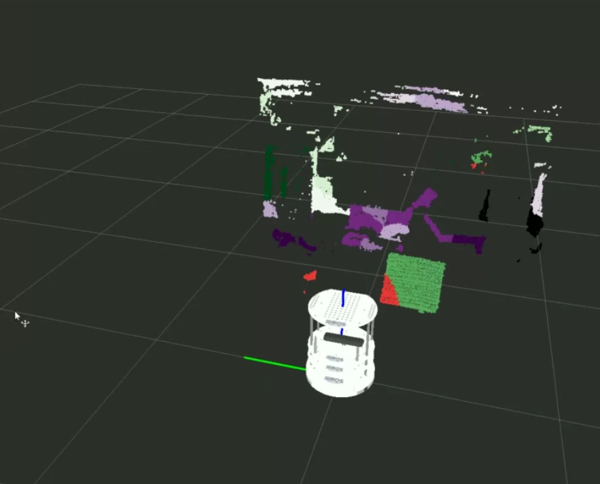
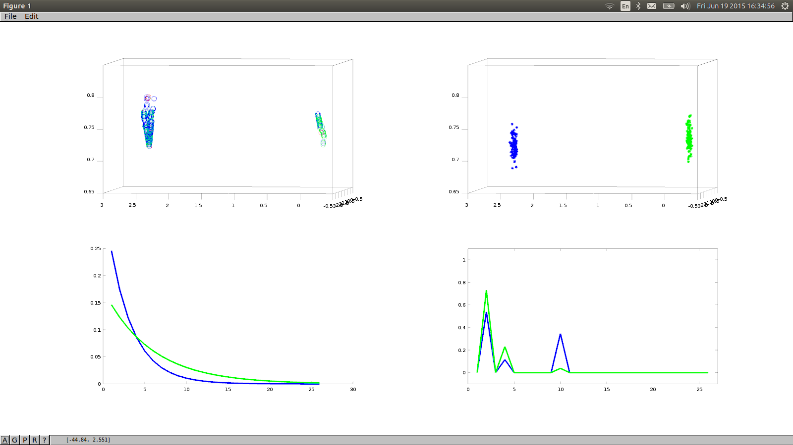

# Landmark matching pipepline.

This pipeline is part of my master thesis and introduces a non-parametric Bayesian approach to the compression problem of long term SLAM.

Since the pointclouds are an expensive means of storing information, it is hard to scale them to very large maps.

Alternative representations that compress environment information are important to make point cloud method scalable.

The method takes as input a point cloud along with some meta information caclulated beforehand and performs clustering on those data.

A decision layer calculates if the clusters are similar to clusters that have been encountered before.

# SMC

Sequential monte carlo method for dependent Dirichlet process.

The sampler will take the points and try to output a mixture of distributions that best fits those data.

The definition of the sampler as well as the theory it extends are described in detail in my thesis report found in my repository.

#Decision layer

In the decision layer the computations of landmark matching are performed

#Dependencies

PCL point cloud operations library
Eigen
OpenCV
Libconfig
Sqlite3(3 is important)

The project It is compiled using -std=c++11 flag

#Linker options are

-lconfig++,-lgsl,-lgslcblas,-lopencv_core,-lopencv_highgui,-lopencv_imgproc,-lsqlite3

#External packages used

**sqlite3pp** *boost free version (source found @ github: https://github.com/hadjichristslave/sqlite3pp)*

#How it works

Main.cpp expects input in a csv file of format:

*x,y,z,Kullback-leibler,EMD,Hellinger,Bin0-Bin26*

x,y,z represent the positional information

KL,EMD,Hellinger the distance distribution between a point and its K nearest neighbors.

The colour spectrum is discretized in bins and colour counts of the neighbor pixels are passed as input.

A Dependent Dirichlet process is used to cluster the points of the environment.

A simple decision layer is added to classify if every cluster is an object the model has encountered before.

That way matching in the distribution space is done. The main motivation is to use this layer in the landmark detection phase of SLAM methods. It will greatly reduce the dimensionality of point clouds as it introduces an very extensive reprentation of a point cloud.

#Benchmark

Detailed Benchmarks can be found in my report.
Generally, provided a good downsampling in the preprocessing, the sampler can be used online

#Output

Past distributions are stored in a sqlite3 database in the local system. If a new distribution/landmark is observed, it is being added in the database. For now I think it is not possible to automatically add a training set, therefore one labeled manually is given to the method.

#Results

The image shows what the sampler clusters as points in the cloud.

Elements are decomposed to clusters with respect to the position, angle and color information they carry.

Each cluster consists of a color(categorical), and angle(exponential) and a position(gaussian) signature of the area it represents. An example signature can be seen in the following picture.

#Anything else

Any further information can be found in my master thesis repository
