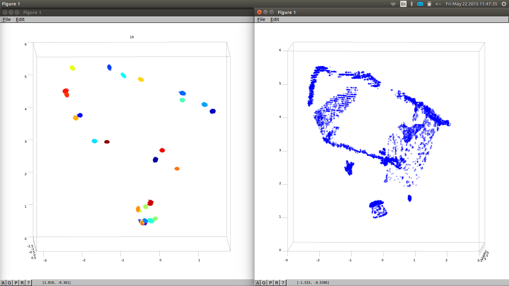

# SMC

Sequential monte carlo method for dependent Dirichlet process.
The sampler is based on the paper as found in http://jmlr.org/proceedings/papers/v33/neiswanger14.pdf.

The model is similar to that as the sampler is created to cluster point clouds rather than pixels.

#Random forest

The model output from the sampler is given as input to a random forest decision tree.
The outcome of this tree is what the algorithm perceives as what we are currently seing through our kinect sensors.

#Dependencies

PCL point cloud operations library
Eigen
OpenCV
Libconfig
Sqlite3(3 is important)

The project It is compiled using -std=c++11 flag

#How to use

Main.cpp expects input in a file of format:

x,y,z,Kullback-leibler,EMD,Hellinger,Bin0,Bin1,Bin2,Bin3,Bin4,Bin5,Bin6,Bin7,Bin8,Bin9,Bin10,Bin11,Bin12,Bin13,Bin14,Bin15,Bin16,Bin17,Bin18,Bin19,Bin20,Bin21,Bin22,Bin23,Bin24,Bin25,Bin26

X,Y,Z represent the positional information
KL,EMD,Hellinger the distance distribution between a point and its K nearest neighbors.

The colour spectrum is discretized in bins and colour counts of the neighbor pixels are passed as input.

//Todo, dynamic number of colour bins
The file path is specified in the config file

Linker options are

-lconfig++
-lgsl
-lgslcblas
-lopencv_core
-lopencv_highgui
-lopencv_imgproc
-lsqlite3

#External packages used

sqlite3pp- boost free version (source found @ github: https://github.com/hadjichristslave/sqlite3pp)
random forest by bjorn andres( Source found @ github: https://github.com/bjoern-andres/random-forest)

#Output

The project outputs in file specified in config file the clusters found on every sample of every pixel.

#Benchmark

The sampler is quite fast.
For 11K points in the cloud and a configuration of 20 samples and 3 particles it takes ~3s to output landmark ID's @ a Intel(R) Core(TM) i5-3210M CPU @ 2.50GHz
As is expected the weight calculations are quite expensive but they can be optimized even further.

#Attention

The files are still modified daily, so any weird behaviour might be due to development issues.

#Results

If the input is a point cloud the resulting clustering will look like this:

The cluster concentration on the part of the point cloud that represents the chair is noticeable.

