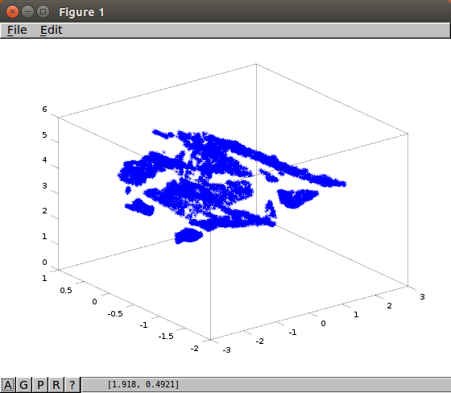
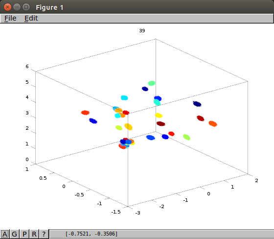
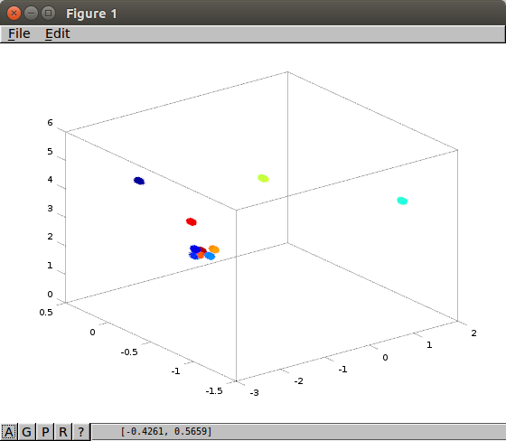

# Feature matching pipeline

This is a feature matching pipeline I implement as my master thesis project.

The basic idea is to take a point cloud and create a compresed representation of its structure.

Compression is one of the two basic issues of long term mapping and tackling it is an initial step to having robots that are constantly mapping an area.

The pipeline consists of two basic pillars. The SMC sampler and the Random forest classifier.

# SMC

Sequential monte carlo method for dependent Dirichlet process.
The definition of the sampler as well as the theory it extends are described in detail in my thesis report found in my repository.

#Random forest

The model output from the sampler is given as input to a random forest decision tree.
The outcome of this tree is what the algorithm perceives as what we are currently seing through our kinect sensors.

#Dependencies

PCL point cloud operations library

Eigen

OpenCV

Libconfig

Sqlite3(3 is important)

The project It is compiled using -std=c++11 flag

#Linker options are

-lconfig++

-lgsl

-lgslcblas

-lopencv_core

-lopencv_highgui

-lopencv_imgproc

-lsqlite3

#External packages used

**sqlite3pp** *boost free version (source found @ github: https://github.com/hadjichristslave/sqlite3pp)*

**random forest** *by bjorn andres( Source found @ github: https://github.com/bjoern-andres/random-forest)*

#How it works

Main.cpp expects input in a csv file of format:

*x,y,z,Kullback-leibler,EMD,Hellinger,Bin0-Bin26*

x,y,z represent the positional information

KL,EMD,Hellinger the distance distribution between a point and its K nearest neighbors.

The colour spectrum is discretized in bins and colour counts of the neighbor pixels are passed as input.

A random forest decision layer is added to classify if every cluster is an object the model has encountered before.

That way matching in the distribution space is done. The main motivation is to use this layer in the landmark detection phase of SLAM methods. It will greatly reduce the dimensionality of point clouds as it introduces an very extensive reprentation of a point cloud.

#Benchmark

The sampler is quite fast.
For 11K points in the cloud and a configuration of 20 samples and 3 particles it takes ~3s to output landmark ID's @ a Intel(R) Core(TM) i5-3210M CPU @ 2.50GHz
As is expected the weight calculations are quite expensive but they can be optimized even further.

The random forest is also fast.
The classification when no new landmarks are given takes less than .01 sec.
If new landmarks are added extra time is needed for the DB operations.
It usually takes less than 1sec to complete its operations.

#Output

The random forest returns the distributions currently being observed in the point cloud.

Past distributions are stored in a sqlite3 database in the local system. If a new distribution is observed, it is being added in the database. For now I think it is not possible to automatically add a training set, therefore one labeled manually is given to the method.

#Results

For an initial image as shown in the first picture, two are the major steps that will take place in this method.

Firstly, a clustering that will output the clusters of the data. The output of an SMC sampler looks as follows

The cluster concentration on the part of the point cloud that represents the chair is noticeable.

Now this output is taken as input to the random forest method. The features taken into account are the distances among their respective distributions.

More specifically:

 * Gaussians
     > Wasserstein
     > KL divergence
 * Exponential 
     > KL divergence
     > Squared Hellinger
 * Categorical
     > EMD
     > KL
     > Hellinger

The label is done manually before hand, and the output of the method is shown in the following figure.

The chair structure is clearly captured as well as some abstractions of the environment.

#Attention

The files are still modified daily, so any weird behaviour might be due to development issues.

